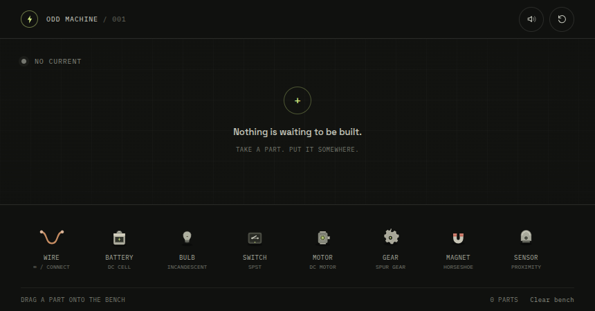
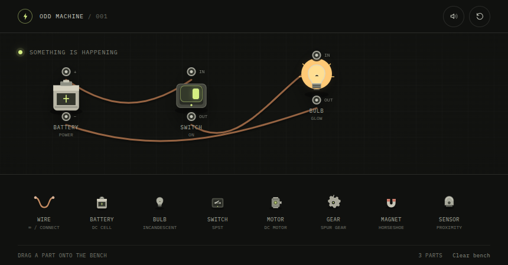

# Odd Machine

An interactive machine-building toy about experimenting with simple electrical and mechanical parts. Build a circuit, see what moves or lights up, and find the strange component hidden in the bench.

## Screenshots

| Empty workbench | Powered bulb circuit |
| --- | --- |
|  |  |

## Demo

<video src="assets/odd-machine-demo.mp4" poster="assets/odd-machine-demo-preview.jpg" controls playsinline width="100%"></video>

[Open or download the demo video](assets/odd-machine-demo.mp4)

The clip shows a two-gear train: the motor turns the first gear, which drives the second.
On-screen captions label the bulb and motor experiments and explain what to watch for.

## Project structure

```text
index.html                 Page structure
styles.css                 Layout, components, and responsive styling
app.js                     Component definitions and machine interactions
tailwind.config.js         Tailwind theme extension
assets/                    Screenshots, demo video, and preview image
```

## Run it

Open `index.html` in a modern browser. Tailwind CSS and the typefaces load from CDNs, so an internet connection is needed for the intended styling.

## Try it

- Add parts by clicking them in the tray, or drag them onto the workbench.
- Select **Wire**, then click two component terminals to connect them.
- Build a closed path from a battery through a bulb or motor and back to the battery.
- Click a switch to open or close its path.
- Put gears near a running motor or another turning gear. Move a magnet near a powered motor; bring the proximity sensor near a powered motor or lit bulb.
- Use **Clear bench** or the reset button to start over.

## Components

| Part | What it represents | What it does in this toy |
| --- | --- | --- |
| Wire | Insulated copper hookup wire | Connects two terminals. |
| Battery | Single DC cell | Supplies a positive and negative terminal. |
| Bulb | Incandescent lamp | Lights when current flows through a closed circuit. |
| Switch | SPST toggle switch | Opens or closes one circuit path. |
| Motor | DC electric motor | Spins when powered. |
| Gear | Spur gear | Transfers rotation when near a running motor or another turning gear. |
| Magnet | Horseshoe permanent magnet | Vibrates near a running motor and speeds it up. This is a fictional interaction. |
| Sensor | Proximity sensor | Lights its indicator near a powered motor or bulb. This is a simplified game rule. |

This is a playful, simplified simulation, not an electronics or physics design tool. It does not model voltage, current limits, component ratings, realistic magnetic forces, or damage from short circuits.